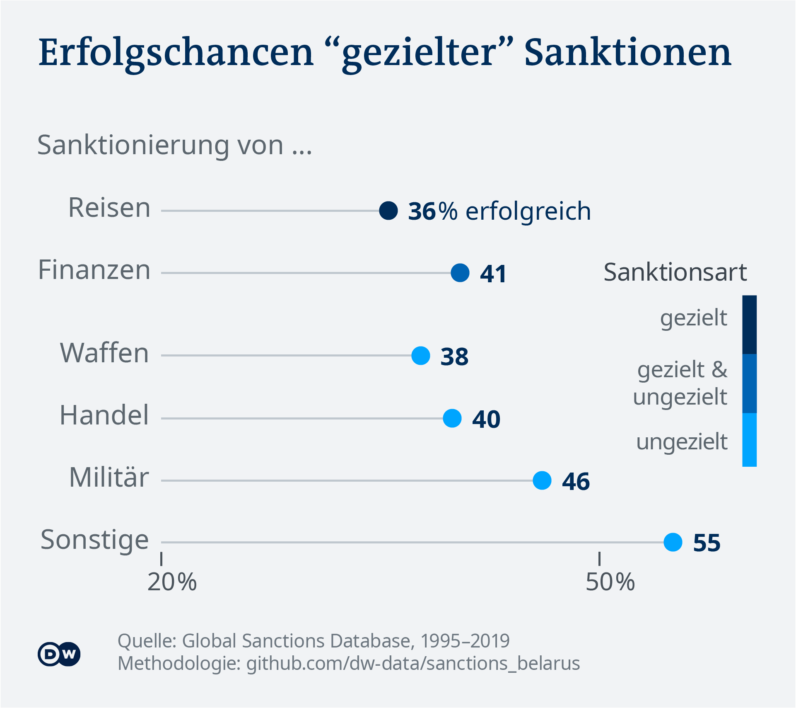
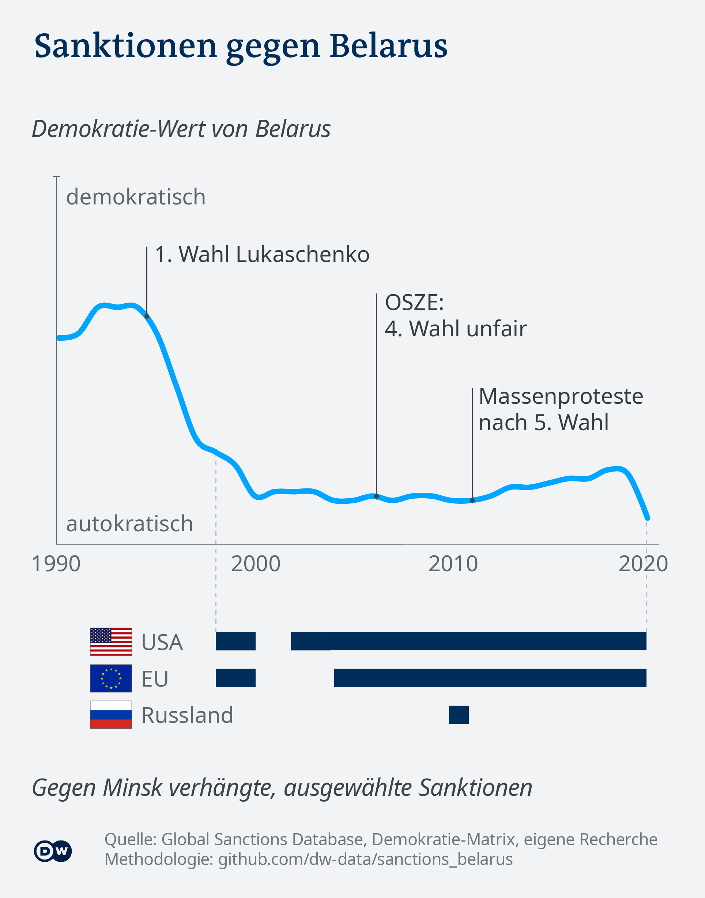

# Sanctions on Belarus

_Idea:_  [Gianna Grün](https://gcgruen.github.io), [Sandra Petersmann](https://twitter.com/PetersmannS)
_Research, data analysis and data visualization:_  [Sandra Petersmann](https://twitter.com/PetersmannS), [Michel Penke](https://michelpenke.de)
_Writing:_  [Sandra Petersmann](https://twitter.com/PetersmannS), [Michel Penke](https://michelpenke.de)

**Read the full articles on DW.com:**
- [XXX](https://www.dw.com/en/xxx)

Modern sanctions have been a tool in international relationships since WWII. While their number has increased dramatically, their design has changed. Instead of attacking the whole economy special vulnerabilities are in the focus of politics. 

DW analyzed how often and under which circumstances sanctions succed and why current sanctions against Belarus might fail. 

The following text will explain the process behind this story: Which data sources were used, how the analysis was conducted and how the data was visualized.

# Source data

| **Data** | **Source** | **Link** |
| --- | --- | --- |
| Dataset about sanctions (1949-2020) | Global Sanction Data Base| [Global Sanction Data Base](https://www.globalsanctionsdatabase.com)|
| Dataset Democracy Score | Julians-Maximilians-Universität Würzburg| [Democracy Matrix](https://www.demokratiematrix.de)|

# Analysis
### Success of sanctions 
The first part of the analysis calculated the success rate of so-called targeted and non-targeted sanctions, meaning very specific travel and financial sanctions against politicians or companies vs. broader embargoes that hurt the whole nation like trade, arms, military and more aggressive financial sanctions. 

Since targeted sanctions became a thing after the Iraqi humanitarian sanction crises only sanctions starting in 1995 have been counted. All sanctions that were totally and partially successful have been summarized as "successful". 

_Known methodological problems: The classification as successful is disputed. Many sanctions do not clearly state their goal, nor is there any evaluation process done by the sanctioning nations. Furthermore, it is difficult to decide whether a sanction has really caused a political change or had no impact on it while other factors have actually caused the success. As a matter of fact, the Global Sanction Data Base does not check whether a sanction actually has been the reason for a political success but marks it as succesful as soon as the goal has been achieved. This may result in a false positive distortion and an overvaluation of sanctions. Nevertheless, there is no better-known approach to classify the sanctions' outcome since the "real" impact of sanctions on political change is nearly impossible to measure. Most times, it is very unlikely that those, who give in on the sanction's pressure and who are, by nature, the only ones who could surely rate the sanction's influence, may admit that they did so forced by others. This could most often result in a loss of political reputation. Additionally, the database of the Institut für Weltwirtschaft is widely accepted in the academic community._
### Comparing sanction's success rate with democracy score
The database has been merged with the Democracy Matrix of the Julius-Miximilians-Universität Würzburg which quantifies the democratic constitution of every country for a long time periode between 0 (total dictatorship) and 1 (total democracy). The researcher from Würzburg mark all nations as followed: 
| **Score** | **Label** |
| --- | --- |
| 0 - 0.25 | hard autocracy |
| 0.25 - 0.5 | moderate autocracy |
| 0.5 - 0.75 | deficient democracy |
| 0.75 - 1 | functioning democracy |
Based on this classification the expected values of success have been calculated for each group. To point out the decrease of success rate for "hard autocracy" their values got compared to the weighted average of all other groups. 

### Belarus' sanctions history
To visualize the history of Belarus and the sanctions aimed at it the Democracy Matrix Score was visualized as a line chart with additional time periode bars. Sanctions that may overlap each other have not been marked as different ones. 
 

